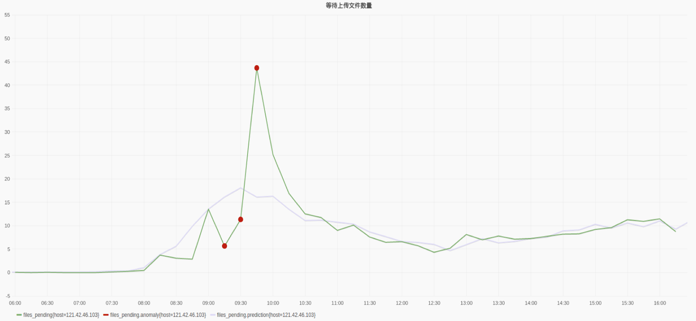

# 快速开始

## 1. 注册登录

如果已有账户，请直接登录

若尚未注册，请免费注册，申请试用

## 2.高端功能

Cloudwiz 利用大数据提供智能运维。由于Cloudwiz整合了整个系统的监控数据并 收集了应用软件业务本身细粒度的数据,它有很大的数据量来判断系统的健康状态。 Cloudwiz 引入** 「数据挖掘」**和**「机器学习」**的手段,自动分析历史数据, 发现规律并预测系统的运指标, 提前发现异常问题并报警。这种报警是不需要运维人员设定规则的。报警规则的 设定有很大的局限性,首先随着系统的复杂度增加,运维人员不可能把所有规则都找到。 其次每个规则都是静态的,比如响应时间慢于1秒。随着系统的运行,规则的静态值可能 不合理。而利用大数据**「自动分析」**就避免了这些局限性,使监控复杂的系统变为可能。

**下图**  **发现规律并预测指标值**

**下图: 根据大数据分析发现异常点**

**下图: 异常点的标示和参数正常区间的估算**

> 除了发现异常并报警，Cloudwiz把智能运维的概念更推进一步。发现问题只是运维过程中的第一步。由于系统越来越复杂，指标数随着架构的复杂度和部署机器的数量成指数增加，想从**成千上万**个指标中找出原因是件很耗时耗力的事情。
>
> 运维中80%以上的时间都花在故障诊断上。Cloudwiz能自动利用大数据**分析问题根源**, 帮助运维人员缩短故障诊断时间。它通过数据挖掘算法找出与故障最**「关联」**的指标，尽量地缩小故障根源的搜索范围，帮助运维人员很快地定位故障根源。

另外，Cloudwiz还和日志高度整合。它不仅提供**「日志聚合」**和搜索功能，还主动提炼日志里的信息来辅助运维。

