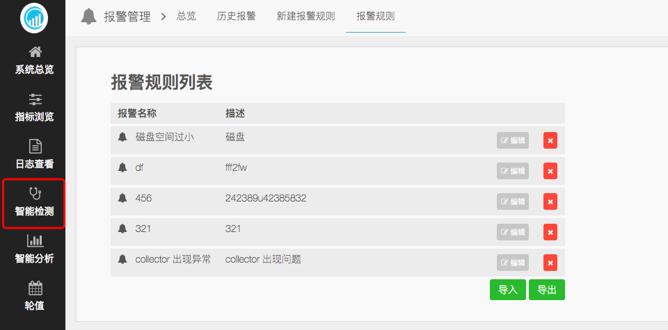

# 快速开始

Cloudwiz对整个系统从上到下\(应用软件, 中间IT组件, 操作系统和网络\)的运行状态进 行实时可视化监控,在一个整体的界面里提供各种曲线和图表。帮助运维人员对整个应用 系统的运行状态一目了然。

     

                                                                                      图 **业务外部访问状态监控**

     

                                                                                           **图** **业务内部状态监控**

                                                                                          

                                                                                        **图  中间件数据库监控**

                                                                                                **图** **系统状态监控**

运维人员可以通过设定报警规则。如果系统发生异常而触发报警，Cloudwiz会通过短信，email等方式通知运维人员。     

                                                                                                 **图 报警规则列表**

