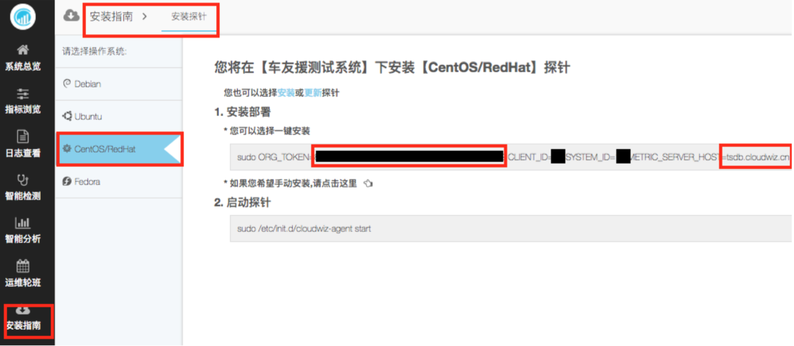

URL: https://tsdb.cloudwiz.cn/api/query

METHOD: GET

Parameters:
  - token:
    - 在 app.cloudwiz.cn 菜单“安装指南\安装探针”里可以找到你的系统的 token。
    
  - start:
    - 查询开始时间。
    - 必须提供。
    - 可以是 timestamp(time epoch),比如 1502763060。也可以是比如 1m-ago, 1h-ago, 1d-ago, 1w-ago, 1yr-ago
  - end:
    - 查询结束时间。
    - 可选。默认为最近。
    - 可以是绝对时间(time epoch),比如 1502763060。也可以是,比如 1m-ago,1h-ago,1d-ago,1w-ago,1yr-ago
  - m:
    - 指标的具体信息。
    - m=<aggregator>:[rate:][<down_sampler>:]<metric_name>[{<tag _name1>=<grouping filter>[,...<tag_nameN>=<grouping_filter>]}][{<tag_name1>= <non grouping filter>[,...<tag_nameN>=<non_grouping_filter>]}]
    - aggregator:[avg|min|max|sum|p50|p75|p90|p99|p999|count]
      - 如果有返回的每个数据点是由多个数据点聚合成的,指定聚合的方法。
      - 比如一个指标可能有几个 host 上都有值,如果我们就返回一个值 (不加 host tag,以下会提到),我们需要指定取什么样的聚会值。
    - rate:
      - 如果是 counter 型的指标,rate 推荐选,得出的结果是增长率。如果不选的话,得到的值是递增的。
    - down_sampler:<interval><units>-<aggregator>
      - 这个跟 aggregator 很像。但是是指在不同的维度(具体是时间)的聚合。
      - 比如 10m-avg 指 10 分钟里所有的数据点的平均值。
    - metric_name:
      - 指标名字。注意不带<org>.<sys>. 这样的前缀。
    - tag:
      - 标签组合,标签之间是 or 的关系。 
      - {tag_name=filter, tag_name=filer,....}
 
 返回值：JSON
     
     
**例子1：**

查询指标 proc.softirqs 最近 2 分钟(start=2m-ago)在所有的 host 的平均值(aggregator 为 m=avg)。取样(down_sampler 为 1m-avg)为每分钟一个点,平均值。
```shell
[Yis-MacBook-Pro anomaly (master)]$ curl -s 'https://tsdb.cloudwiz.cn/api/query?token=xxxxxxxxxxxxx&start=2m-ago&m=avg:1m- avg:proc.softirqs'
[{
  "metric":"13.19.proc.softirqs",
  "tags":{},
  "aggregateTags":["host","type","cpu"],
  "dps":{
    "1502768700":6.337152280416667E7,
    "1502768760":6.337238234166667E7
   }
}]
```

**例子2：**

查询指标 proc.softirqs 从 1502768700 到 1502768760 (start=1502768700&end=1502768760 )在所有的 host 的平均值(aggregator 为 m=avg)。取样(down_sampler 为 1m-avg)为每分钟一个点,平均值。

结果跟例子 1 一致。
```shell
[Yis-MacBook-Pro anomaly (master)]$ curl -s 'https://tsdb.cloudwiz.cn/api/query?token=xxxxxxxxxxxxx&start=1502768700&end=1502768760&m=avg:1m-avg:proc.softirqs'
[{
  "metric":"13.19.proc.softirqs",
  "tags":{},
  "aggregateTags":["host","type","cpu"],
  "dps":{
    "1502768700":6.337152280416667E7,
    "1502768760":6.337238234166667E7
   }
}]
```

**例子3：**

查询指标 proc.softirqs 最近 20 分钟(start=20m-ago)在所有的 host 的平均值 (aggregator 为 m=avg)。取样(down_sampler 为 5m-avg)为每 5 分钟一个点,平均值。
```shell
[Yis-MacBook-Pro anomaly (master)]$ curl -s 'https://tsdb.cloudwiz.cn/api/query?token=xxxxxxxxxxxxx&start=20m-ago&m=avg:5m- avg:proc.softirqs'
[{
  "metric":"13.19.proc.softirqs",
  "tags":{},
  "aggregateTags":["host","type","cpu"],
  "dps":{
    "1502768700":6.337315828416667E7,
    "1502769000":6.337685999083333E7,
    "1502769300":6.338046636083331E7,
    "1502769600":6.338327356472223E7
  }
}]
```

**例子4：**

查询指标 proc.softirqs 最近 20 分钟(start=20m-ago)在所有的 host 的平均值 (aggregator 为 m=avg)的增长率(rate)。取样(down_sampler 为 5m-avg)为每 5 分钟 一个点,平均值。
```shell
[Yis-MacBook-Pro anomaly (master)]$ curl -s 'https://tsdb.cloudwiz.cn/api/query?token=xxxxxxxxxxxxx&start=20m-ago&m=avg:rate:5m- avg:proc.softirqs'
[{
  "metric":"13.19.proc.softirqs",
  "tags":{},
  "aggregateTags":["host","type","cpu"],
  "dps":{
    "1502769000":12.339022222225372,
    "1502769300":12.021233333334424,
    "1502769600":12.342305555555466,
    "1502769900":11.890274382719204
  }
}]
```

**例子5：**

查询指标 proc.softirqs 最近 2 分钟(start=2m-ago)在每个 host 的值(aggregator 为 m=avg,其实无意义)。取样(down_sampler 为 1m-avg)为每分钟一个点,平均值。
```shell
[Yis-MacBook-Pro anomaly (master)]$ curl -s 'https://tsdb.cloudwiz.cn/api/query?token= xxxxxxxxxxxxx&start=2m-ago&m=avg:1m-avg:proc.softirqs\{host=*\}'
[{
  "metric":"13.19.proc.softirqs",
  "tags":{"host":"qa-app1-server"},
  "aggregateTags":["type","cpu"],
  "dps":{
    "1502769060":2.07839727075E8,
    "1502769120":2.0784044395E8
  }
},
{
  "metric":"13.19.proc.softirqs",
  "tags":{"host":"qa-app2-server"},
  "aggregateTags":["type","cpu"],
  "dps":{
    "1502769060":8.5932606E7,
    "1502769120":8.593321025E7
  }
},
{
  "metric":"13.19.proc.softirqs",
  "tags":{"host":"qa-weixin-server"},
  "aggregateTags":["type","cpu"],
  "dps":{
    "1502769060":2.06701815E7,
    "1502769120":2.067051905E7
  }
},
{
  "metric":"13.19.proc.softirqs",
  "tags":{"host":"qa-mq-server"},
  "aggregateTags":["type","cpu"],
  "dps":{
    "1502769060":4.55673226E7,
    "1502769120":4.556812125E7
  }
},
{
  "metric":"13.19.proc.softirqs",
  "tags":{"host":"qa-db-server"},
  "aggregateTags":["type","cpu"],
  "dps":{
    "1502769060":1.0123540075E7,
    "1502769120":1.01239101E7
  }
}]
```
 
